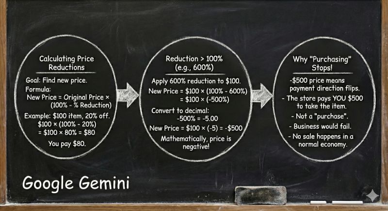

# Chalk Talk Board Generator (README)

This prompt generates a **chalkboard-style “chalk talk” slide** for teaching a concept: bubbles/circles connected by arrows, short handwritten-style text, and a visual flow that mirrors how an instructor would explain the idea at a board.

This workflow performs best when the model’s **thinking mode** is enabled (for example, **Extended Thinking** in ChatGPT or **Pro** mode in Gemini), especially when it must balance: (i) correct math, (ii) readable layout, and (iii) minimal text per bubble.

---

## What it is for

Use `chalk-talk.prompt` when you want to:

- Turn a concept (math, security, architecture, etc.) into a **single-slide board explanation**
- Keep the explanation **visual and structured**, not a wall of text
- Produce a slide that works as a **standalone teaching artifact** (for lecture, lab, or a talk)

This is particularly useful for “confusing but teachable” questions, where a diagrammatic progression helps.

---

## What you provide

- The **teaching concept** (1 sentence), ideally phrased as a question
- 3–5 **key points** that must appear (one per bubble)
- Optional: a required **example** (numbers, scenario), and what misconception you want to correct

---

## What you get (deliverables)

The prompt is designed to produce:

- A **single chalkboard slide** with:
  - 3 main bubbles/circles
  - arrows between bubbles
  - short, readable text
  - a worked micro-example if relevant
- A **layout plan** (bubble titles + what goes inside each)
- Optional: a **one-paragraph narration script** matching the diagram flow
- Optional: **alt text** for accessibility

---

## How to run it

1. Open the prompt definition in **`chalk-talk.prompt`**.
2. Provide the concept and the required bubble contents.
3. Ask the model to output:
   - an **image-generation prompt** (for an image model), and
   - the **bubble-by-bubble layout plan** (so you can edit quickly if needed)
4. Generate the image using your preferred image tool.
5. If the result is hard to read, rerun with:
   - fewer words per bubble
   - larger text constraints
   - fewer decorative elements

---

## Example figures (from the LinkedIn post)

These example images are included from the referenced post so you can see what “good” output looks like.

### Example 1: ChatGPT 5.2 chalk talk slide


### Example 2: Google Gemini chalk talk slide



### Example 3: Phone-generated variant (comment thread)


---

## Repository layout

- `README.md` — this file  
- `chalk-talk.prompt` — the prompt definition (copy/paste into your LLM tool)  
- `examples/` — example figures from the referenced LinkedIn post

---

## Attribution / credit

This prompt is adapted from the chalk talk prompt shared by **Todd Austin** on LinkedIn:

```text
https://www.linkedin.com/posts/prof-todd-austin_ai-aieducation-freakonomics-activity-7408897901285904384-CzR0/
```

---

## Practical tips

- **Readability wins**: cap each bubble to ~20–35 words.
- Use **one worked example** only (too many numbers kills the board feel).
- If you need a multi-slide sequence, run the prompt once per slide and keep bubble labels consistent.
- For technical topics, reserve one bubble for “common misconception / why it’s wrong.”

